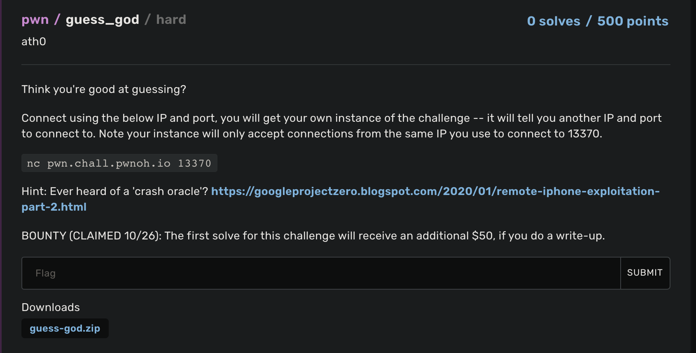
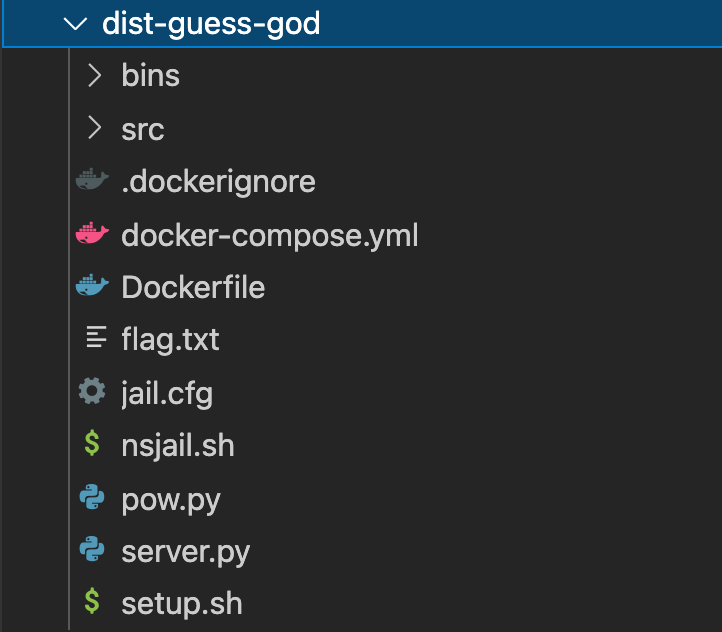
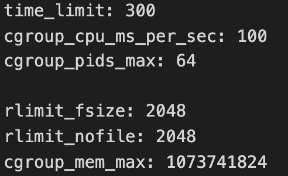

In this article, I'll discuss about the application of the technique described by [Samuel Groß](https://twitter.com/5aelo) in his [Remote iPhone Exploitation Part 2: Bringing Light into the Darkness -- a Remote ASLR Bypass](https://googleprojectzero.blogspot.com/2020/01/remote-iphone-exploitation-part-2.html). 

To show this I'm gonna solve a pwnable challenge from [Buckeye CTF](https://ctf.osucyber.club/).

I'll try to keep the content as beginner friendly as possible, so feel free to skip any section if you feel confident enough and just want to see the conclusion.

# 0. Introduction

 

I didn't play the CTF, but I got interested in the challenge about 2hrs before the ctf end thanks to [Guray00](https://github.com/Guray00), who was asking for help in [fibonhack](https://twitter.com/fibonhack) discord about some crypto shenanigans. 

I couldn't help him, but I took a look at pwnable challenges, and figured it would be good to pratically apply some knowledge gathered by the reading of a P0 entry and hopefully get that bounty.

## 0.1 The challenge

Thankfully to the author, the zip contains binaries, source code and dockerfile to reproduce the same environment as the remote one.

 
  

By scrolling through the files we can notice some useful things:

- jail.cfg restrictions   
- lol

lol