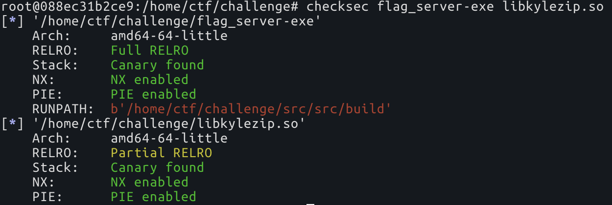
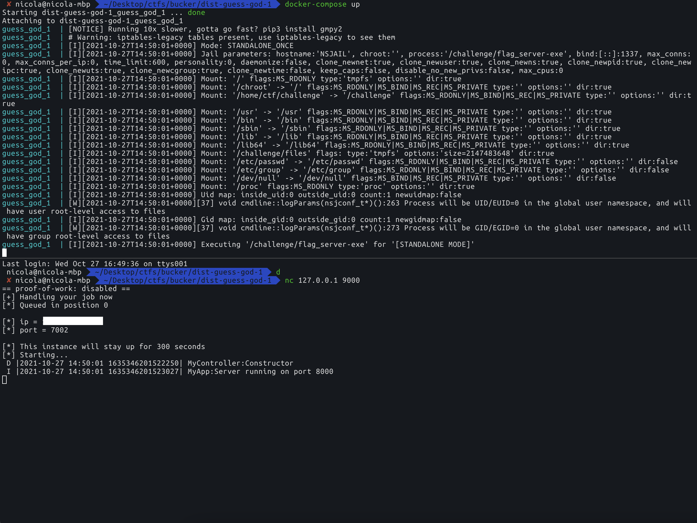
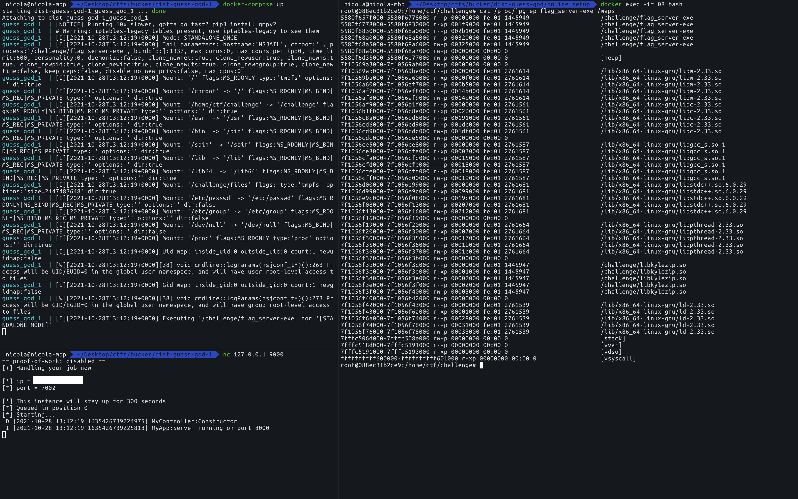
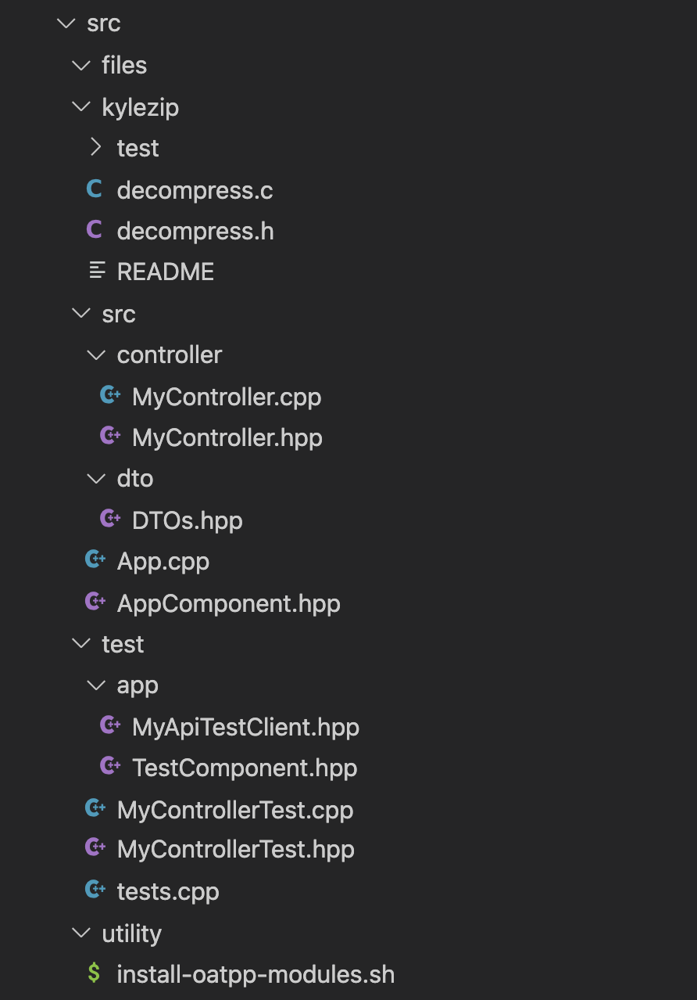
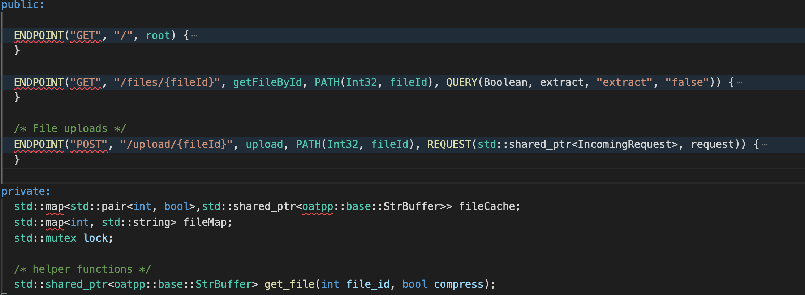

# guess_god writeup

In this article, I'll discuss about the application of the technique described by [Samuel Groß](https://twitter.com/5aelo) in his [Remote iPhone Exploitation Part 2: Bringing Light into the Darkness -- a Remote ASLR Bypass](https://googleprojectzero.blogspot.com/2020/01/remote-iphone-exploitation-part-2.html), to bypass ASLR on Linux x86_64. 

To show this I'm gonna solve a pwnable challenge from [Buckeye CTF](https://ctf.osucyber.club/), guess_god.

I'll try to keep the content as beginner friendly as possible, so feel free to skip any section if you feel confident enough and just want to see the exploit.

# 0. Introduction
<p align="center"></p><br/>

I didn't play the CTF, but I got interested in the challenge about 2hrs before the ctf end thanks to [Guray00](https://github.com/Guray00), who was asking for help in [fibonhack](https://twitter.com/fibonhack) discord about some crypto shenanigans. 

I couldn't help him, but I took a look at pwnable challenges, and figured it would be good to pratically apply some knowledge gathered by the reading of a P0 entry and hopefully get that bounty.

## 0.1 The challenge

Thankfully to the author, the zip contains binaries, source code and dockerfile to reproduce the same environment as the remote one.

<p align="center"> <p/> <br/>

## 0.2 Initial foothold

Before jumping into the challenge, It's always a good thing to grasp some knowledge about the environment, let's scroll through the files and take some notes.

* jail.cfg set some restrictions, let's not forget about those limits since they might screw up the exploit:
  ```
  time_limit: 300
  cgroup_cpu_ms_per_sec: 100
  cgroup_pids_max: 64
  rlimit_fsize: 2048
  rlimit_nofile: 2048
  cgroup_mem_max: 1073741824
  ```

* From the Dockerfile we can learn some interesting things:
  1. Build and install oatpp 1.2.5, maybe there are useful bugs in this specific version?
     ```Docker
     # Install oatpp
     RUN git clone https://github.com/oatpp/oatpp.git
     RUN cd /oatpp && git checkout 1.2.5 && mkdir build && cd build && cmake .. && make install
     ```
  
  2. It builds the challenge from scratch
     ```docker
     WORKDIR /home/ctf/challenge/src/
     RUN mkdir -p src/build && cd src/build && cmake .. && make
     RUN cp src/build/flag_server-exe src/build/libkylezip.so flag.txt /   home/  ctf/challenge/
     ```
     This might be a problem, so let's copy the distribuited binaries  instead.
     ```docker
     COPY bins/flag_server-exe /home/ctf/challenge/
     COPY bins/libkylezip.so /home/ctf/challenge/
     ```
* And the last thing, check the protections of the binaries provided
  <p align="center"> <br/> <i></i></p>
  Sweet, libkylezip.so is compiled with Partial RELRO, that means that the GOT is writable, keep that in mind for when we want to get code execution.

## 0.3 Setup the local environment and poke the application

docker-compose.yml file is provided so it is not hard at all to get a working local environment to poke. For those of you that are not confident with docker here is the list of commands you need to know to poke the challenge locally.

```bash
docker-compose build # Build the image, do this whenever you change something
docker-compose up # start the container
docker-compose down # stop the container

docker ps # list containers
docker exec -it <CONTAINER ID> <COMMAND> # exec COMMAND into the container
```

After doing `docker-compose build` you can execute `docker-compose up` to start the container, and connect to the challenge with `nc 127.0.0.1 9000`
<p align="center"> <br/> <i></i><p/> 

# 1. Application of Saelo blogpost on Linux

Since the author hints to read the blogpost about the [ASLR bypass](https://googleprojectzero.blogspot.com/2020/01/remote-iphone-exploitation-part-2.html), it's not a bad idea to start by reading it.

I definitely can't explain as well as Saelo did, so read it if you want to understand it well. But that's my attempt to explain what I got from reading it, keeping in mind that I wanted to apply this bypass to Linux.

You need two things to bypass ASLR:

* A memory spraying technique, and as [he says](https://googleprojectzero.blogspot.com/2020/01/remote-iphone-exploitation-part-2.html#:~:text=By%20abusing%20a%20memory%20leak%20(not%20an%20information%20leak!)%2C%20a%20bug%20in%20which%20a%20chunk%20of%20memory%20is%20%E2%80%9Cforgotten%E2%80%9D%20and%20never%20freed%2C%20and%20triggering%20it%20multiple%20times%20until%20the%20desired%20amount%20of%20memory%20has%20been%20leaked.) there are two ways of doing it:
  1. By abusing a memory leak (not an information leak!), a bug in which a chunk of memory is “forgotten” and never freed, and triggering it multiple times until the desired amount of memory has been leaked.
  2. By finding and abusing an “amplification gadget”: a piece of code that takes an existing chunk of data and copies it, potentially multiple times, thus allowing the attacker to spray a large amount of memory by only sending a relatively small number of bytes.

* An oracle, which tells you wheter or not a given address is mapped, something like that:
  ```py
  def oracle(addr): 
    if isMapped(addr):
        print ("YES")
    else
        print ("NO")
  ```

On iOS 12.4 you could completely break ASLR by allocating 256mb of memory, as explained [here](https://googleprojectzero.blogspot.com/2020/01/remote-iphone-exploitation-part-2.html#:~:text=In%20fact%2C%20only%20about%20256MB%20of%20data%20need%20to%20be%20sprayed%20to%20put%20controlled%20data%20at%20a%20known%20address)

```C
    const size_t size = 0x4000;
    const size_t count = (256 * 1024 * 1024) / size;
    for (int i = 0; i < count; i++) {
        int* chunk = malloc(size);
        *chunk = 0x41414141;
    }
   // Now look at the memory at 0x110000000
```

Running this in on iOS (e.g. as part of a custom App) will put 0x41414141 at address 0x110000000:
```
(lldb) x/gx 0x110000000
0x110000000: 0x0000000041414141
```

Of course we can't copy paste this technique to Linux and expect it to work, in fact aslr on Linux is not that weak. But we can get some intuitions about [the technique he describes there](https://googleprojectzero.blogspot.com/2020/01/remote-iphone-exploitation-part-2.html#:~:text=Given%20that%2C%20breaking%20ASLR%20remotely%20would%20be%20rather%20straightforward%3A).

Given: 
* a range of possible addresses `[a,b]`
* a memory spraying technique that let you map contiguous memory of size `s`, in the range `[a,b]`
* an oracle which tells you wether an address is mapped or not 

then in order to find a mapped address you can do this linear scan:
```python
start = a
for addr in range(a, b, size):
    if isMappedOracle(addr) == True:
        print (f"Found mapped address: {addr:#x}")
        break
```

for a total of `(a - b) / size` queries.

## 1.1 Memory mappings on linux usermode applications

Let's try grasp some knowledge about the memory layout, maybe some patterns exist also there?

On linux, you can inspect the mappings of a process given its pid through procfs
```
cat /proc/<pid>/maps
```

To do this, spawn a local instance of the challenge and read the process maps. That was my setup for the ctf:

<p align="center"> <br/> <i></i><p/> 

Well, if you do this a couple of times, you will be confident enough of those things at least:
* The binary PIE base can be in the range 0x00005500_00000000-0x00005700_00000000, that means 2TB of possible addresses.
* The heap is near the binary.
* Libraries are in the range 0x00007f00_00000000 - 0x00007fff_ffffffff, for a total of 1TB of possible addresses.
* Stack goes in the range 7fff_00000000 - 7fff_ffffffff, for a total of only 4gb of possible addresses, well that's weaker.
* The range 0xffffffffff600000 - 0xffffffffff601000 is always mapped, you can read [this article](http://terenceli.github.io/%E6%8A%80%E6%9C%AF/2019/02/13/vsyscall-and-vdso) if you are curious about it.


## 1.2 Applicability of memory spraying + linear scan given those random maps


# 2. Source code analysis
<p align="center"> <br/> <i></i><p/> 

After all that's a ctf challenge, so the source code is not as huge as a real application, it's mostly glue code to get an oatpp web server up and running. 

In fact the important files which we are gonna analyze are:
* src/controller/MyController.*
* kylezip/decompress.*

## 1.1 MyController

<p align="center"> <br/> <i>MyController.hpp</i><p/> 

There are 3 endpoints:
* /
* GET /files/{fileId} -> Download a prevoiusly uploaded file, if extract is true extract before downloading it.
* POST /upload/{fileId} -> Upload a file given a {fileId}.

And one function implemented in `MyController.cpp`
```C
std::shared_ptr<oatpp::base::StrBuffer> MyController::get_file(int file_id, bool extract) 
``` 
I'm gonna highlight what's useful to us:
* Set `to_open` to `{file_id}` or `{file_id}.unkyle`
  ```C
  std::ostringstream comp_fname;
  comp_fname << filename;
  if (extract) {
    // Want the un-kylezip-d version
    comp_fname << ".unkyle";
  }
  auto to_open = comp_fname.str();
  ```
* If it's the first time we are requesting to extract this file_id then it calls decompress \(from `libkyle.so`\) on it,
  which will write the decompressed version of `{filename}` to `{filename}.unkyle`.
  ```C
  int fd = open(to_open.c_str(), O_RDONLY);
  if (fd == -1) {
      if (!extract) return NULL;

      /* Need to create decompressed version of file
       * Kyle gave me a buggy library so we are going to fork
       * in case we crash the web server will still stay up.
       */
      pid_t p = fork();
      if (p == 0) {
        decompress(filename);
        exit(0);
      } else {
        waitpid(p, NULL, 0);
      }


      fd = open(to_open.c_str(), O_RDONLY);
      if (fd == -1) {
        return NULL;
      }
  }
  ```
* lol
  ```C
  ```

```C
std::shared_ptr<oatpp::base::StrBuffer> MyController::get_file(int file_id, bool extract) {
  
  int fd = open(to_open.c_str(), O_RDONLY);
  if (fd == -1) { // It's the first time we are requesting to extract this file_id
      if (!extract) return NULL;

      /* Need to create decompressed version of file
       * Kyle gave me a buggy library so we are going to fork
       * in case we crash the web server will still stay up.
       */
      pid_t p = fork();
      if (p == 0) {
        decompress(filename);
        exit(0);
      } else {
        waitpid(p, NULL, 0);
      }


      fd = open(to_open.c_str(), O_RDONLY);
      if (fd == -1) {
        return NULL;
      }
  }

  struct stat sb;
  
  if (fstat(fd, &sb) != 0) {
      return NULL;
  }
  
  /* mmap the file in for performance, or something... idk kyle made me write this */
  // 
  void *mem = mmap(NULL, sb.st_size, PROT_READ, MAP_PRIVATE, fd, 0);
  if (mem == NULL) return NULL;
  
  ...

}```